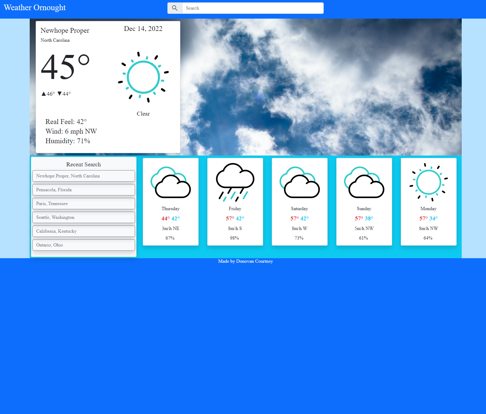

# Weather Ornought

## Description
Weather Ornought is a simple weather app that provides current weather data and a 5 day forecast for a searched location. The app also saves up to 5 recent searches for easy weather retreival. Currently, the site will only search for U.S. cities and states.

The purpose of this project was to apply my understanding of JQuery, Bootstrap, and making API calls. So, most of the design and html elements are programmatically built and updated via the JS script. Bootstrap is utilized in the HTML doc and JS script and the Openweathermap API is used to query for weather data.

Deployed Project: https://decourtney.github.io/weather-ornought/

 
    
  
          
    

 

## Installation

N/A

## Usage

When Weather Ornought is first visited users will be prompted to share their location which is used to select close locations. The site loads with a default search of "United States". Users can perform a search for city and state or just city. If just a city is provided the API returns 5 locations matching the search terms. If users share their location then the closest location is displayed else the first location is selected. Only up to 5 of the most recent locations are stored and displayed as clickable links to retrieve its weather data. Upon revisiting the site, the last searched location will be displayed.

## Credits

N/A

## License

MIT License

Copyright (c) 2022 decourtney

Permission is hereby granted, free of charge, to any person obtaining a copy
of this software and associated documentation files (the "Software"), to deal
in the Software without restriction, including without limitation the rights
to use, copy, modify, merge, publish, distribute, sublicense, and/or sell
copies of the Software, and to permit persons to whom the Software is
furnished to do so, subject to the following conditions:

The above copyright notice and this permission notice shall be included in all
copies or substantial portions of the Software.

THE SOFTWARE IS PROVIDED "AS IS", WITHOUT WARRANTY OF ANY KIND, EXPRESS OR
IMPLIED, INCLUDING BUT NOT LIMITED TO THE WARRANTIES OF MERCHANTABILITY,
FITNESS FOR A PARTICULAR PURPOSE AND NONINFRINGEMENT. IN NO EVENT SHALL THE
AUTHORS OR COPYRIGHT HOLDERS BE LIABLE FOR ANY CLAIM, DAMAGES OR OTHER
LIABILITY, WHETHER IN AN ACTION OF CONTRACT, TORT OR OTHERWISE, ARISING FROM,
OUT OF OR IN CONNECTION WITH THE SOFTWARE OR THE USE OR OTHER DEALINGS IN THE
SOFTWARE.